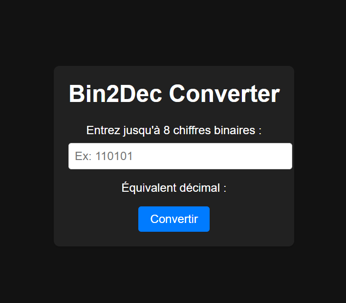

# BinToDecimal-Converter
# Convertisseur Binaire en Décimal

Bin2Dec est une petite application web qui permet de convertir des nombres binaires en nombres décimaux. Ce projet a été réalisé dans le cadre d'un défi de programmation pour aider les débutants à pratiquer et à comprendre les concepts de numération binaire et décimale.

## Fonctionnalités

- L'utilisateur peut saisir jusqu'à 8 chiffres binaires dans le champ de saisie.
- L'application vérifie en temps réel la validité de l'entrée de l'utilisateur et fournit des commentaires.
- L'utilisateur visualise les résultats dans le champ de sortie, affichant l'équivalent décimal du nombre binaire saisi.

## Capture d'écran

## Comment exécuter l'application localement

1. Clonez ce dépôt sur votre machine locale.
2. Ouvrez le fichier `index.html` dans votre navigateur web préféré.

## Améliorations possibles

- Permettre à l'utilisateur d'entrer un nombre variable de chiffres binaires.
- Ajouter une option pour basculer entre les thèmes clair et sombre.

## Ressources

- [Système de numération binaire](https://en.wikipedia.org/wiki/Binary_number)

---

Ce projet a été réalisé par [Charbel SONON](https://github.com/AsKing07) dans le cadre de l'apprentissage du développement web. Si vous avez des suggestions d'amélioration ou des questions, n'hésitez pas à ouvrir une issue ou à soumettre une demande de pull.

